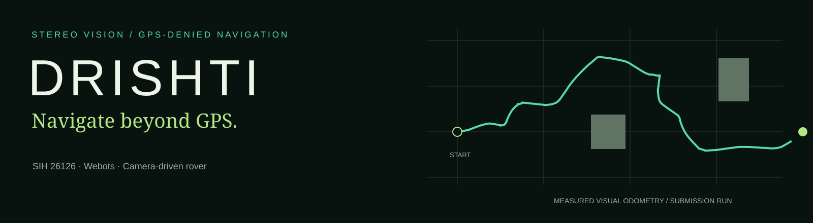
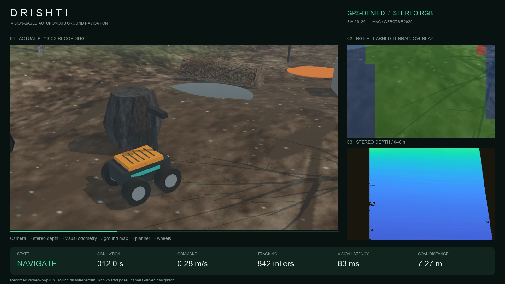

<p align="center"></p>

**A camera-driven rover for GPS-denied outdoor navigation.** Built for SIH problem **26126**, Bharat Electronics Limited.

DRISHTI turns a calibrated stereo RGB pair into depth, a visual position estimate, terrain evidence, and wheel commands. The current 2.0 integration adds a learned terrain classifier, keyframe relocalization, slope-aware mapping, and a Nepal-inspired disaster scene with actual terrain collision geometry. It runs in **Webots on macOS or Linux**, without ROS 2 or an NVIDIA GPU.

[Watch the measured baseline mission](demo/mission.mp4) · [Evidence and limitations](docs/STATUS.md) · [2.0 engineering changes](docs/UPGRADE_2.md) · [Submission guide](docs/SUBMISSION.md)

[](demo/mission.mp4)

### Run it

Install [Webots R2025a](https://github.com/cyberbotics/webots/releases/tag/R2025a), then:

```bash
python3 -m venv .venv
source .venv/bin/activate
pip install -r requirements.txt
python run.py test
python webots/launch.py --world disaster --record --exit
```

Use `--webots /path/to/Webots.app` if Webots is outside Applications, or pass the Linux executable. `--fast` accelerates simulation; it still renders camera images. Every launch uses a fresh results directory, regenerates the disaster world, and copies its evaluation manifest. Do not reuse a results folder.

For an immediate presentation without running the simulator:

```bash
python run.py demo
```

This opens a local evidence viewer with the **recorded baseline** video and synchronized telemetry. It is not a live robot connection.

### What makes the implementation inspectable

| Stage | Implementation | Evidence boundary |
|---|---|---|
| Path perception | 40 visual/depth features → NumPy MLP, plus stereo geometric hazards | 8,000 procedural training patches; 2,000 held-out patches. Synthetic accuracy is not field accuracy. |
| Localization | LK/PnP stereo odometry; ORB keyframes, relocalization and bounded SE(3) loop correction | Corrected keyframe landmarks and rebuilt occupancy map; no claim of bundle adjustment. |
| Ground mapping | RANSAC with inlier refitting; terrain-relative height and slope | A failed plane fit cannot certify new free ground. |
| Planning | Inflated A*, slope/risk costs, observed-footprint and braking-envelope checks | Expired obstacle evidence becomes unknown; repeated ground observations are required to clear occupancy. |
| Simulation | Wheeled rover, calibrated stereo pair, collidable height field, debris and water exclusion zone | A separate Supervisor evaluates truth; navigation cannot read it. No fluid, soil or flood-current physics. |

### Measured baseline (Forest Course)

The initial course contains flat, static obstacles:

| Result | Measured value |
|---|---:|
| Mission time | 62.78 simulation seconds |
| Position RMSE, without trajectory alignment | 1.21 cm |
| Conservative obstacle clearance | 37.83 cm |
| Goal distance | 36.38 cm |

Raw baseline measurements are in [`results/submission_run`](results/submission_run).

### Measured Disaster Mission (`disaster_validation_06`)

The primary SIH 26126 validation evaluates autonomous navigation across rough, flood-carved terrain with slopes, boulders, fallen timber, concrete ruins, and mud pools:

| Metric | Measured Value |
|---|---:|
| Mission time | 36.86 simulation seconds |
| Goal status | Reached (10.0 m checkpoint verified by Supervisor) |
| Position RMSE, without trajectory alignment | 2.65 cm |
| Continuous tracking fraction | 99.74% |
| Solid obstacle clearance | +7.08 cm |
| Maximum body tilt | 7.49° |
| Median vision compute latency | 77.1 ms |

View the interactive offline demonstration with synchronized telemetry via `python run.py demo` (or open `demo/index.html`). Full audit status in [STATUS](docs/STATUS.md).

### Repository map

- `src/drishti/` — portable perception, localization, mapping and control.
- `webots/` — scene generators, robot controller and independent evaluator.
- `tests/` — numerical, geometry and safety regressions.
- `demo/` — actual baseline movie and evidence viewer.
- `results/` — curated measured results with scenario provenance.
- `archive/` — historical experiments; not the current launch path.

This is a **simulation research prototype**, not a deployable flood-rescue robot. Its strongest next experiments are held-out materials/lighting, loop routes, camera interruptions, moving obstacles, steeper slopes and physical traction tests. See [third-party notices](THIRD_PARTY_NOTICES.md) for asset attribution.
